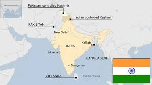

# Smart-Disaster-Management-System
# 🚨 Smart Disaster Management System

<p align="center">
  
</p>

<h3 align="center">
  A Web-Based Platform for Disaster Alerts, Emergency Response & Management
</h3>

<p align="center">
  
  
  
  
  
  
  
</p>

---

## 📌 About The Project

**Smart Disaster Management System** is a web-based disaster management platform designed to help users access important disaster-related information and emergency resources from a single platform.

The system provides features such as disaster alerts, emergency contacts, shelter information, incident reporting, interactive maps, an SOS facility and administrative management.

The project focuses on improving communication, emergency awareness and access to critical information during natural disasters such as floods, landslides, cloudbursts and other emergency situations.

---

## 🎯 Objectives

- Provide disaster-related information through a centralized platform.
- Display important emergency alerts and updates.
- Help users find nearby shelters and emergency resources.
- Allow users to report disaster-related incidents.
- Provide emergency contact information.
- Provide an interactive map for disaster-related locations.
- Provide an administrative dashboard for managing system information.
- Improve accessibility of emergency information during disasters.

---

## ✨ Key Features

### 🚨 Disaster Alerts
- Display active disaster alerts.
- Provide important information about ongoing situations.
- Help users stay informed about emergency conditions.

### 🆘 SOS / Emergency Support
- Quick access to emergency information.
- Emergency contact resources.
- Useful information during critical situations.

### 📍 Interactive Disaster Map
- Interactive map using **Leaflet**.
- Display disaster-related locations.
- Help users understand affected areas and important locations.

### 🏠 Shelter Information
- Display available shelter information.
- Provide location-related details.
- Help users identify possible safe locations.

### 📝 Incident Reporting
- Users can report disaster-related incidents.
- Incident information can be managed through the system.
- Helps collect information about disaster situations.

### 👨‍💼 Admin Dashboard
- Administrative interface for managing system information.
- Manage alerts and incident-related information.
- Centralized management of disaster resources.

### 🖼️ Photo Gallery
- Disaster-related images and information.
- Visual representation of disaster situations.

### 📚 Resources
- Important disaster-management resources.
- Emergency information and useful references.

---

## 🛠️ Technologies Used

### Frontend
- HTML5
- CSS3
- JavaScript
- Leaflet.js

### Backend
- Node.js
- Express.js

### Database
- MySQL

### Other Tools
- Git
- GitHub
- VS Code
- REST API

---

## 📂 Project Structure

```text
Smart-Disaster-Management-System/
│
├── backend/
│   └── Backend/API related files
│
├── css/
│   ├── script.js
│   └── style.css
│
├── database/
│   └── schema.sql
│
├── frontend/
│   ├── index.html
│   ├── about.html
│   ├── admin.html
│   ├── admin-dashboard.html
│   ├── alerts.html
│   ├── map.html
│   ├── photo-gallery.html
│   ├── project_report.html
│   ├── report.html
│   ├── resources.html
│   └── shelter.html
│
├── image/
│   └── Project images
│
├── tool/
│   └── Supporting resources
│
├── uploads/
│   └── Uploaded files/images
│
├── video/
│   └── Disaster-related videos
│
├── working code for project/
│   └── Additional project code
│
├── README.md
└── smart distar ppt.pptx
